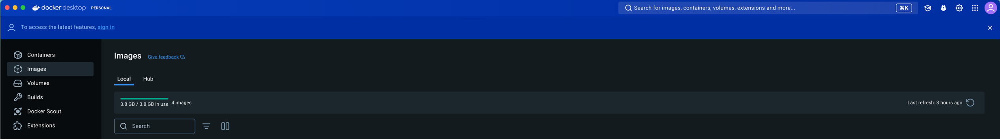
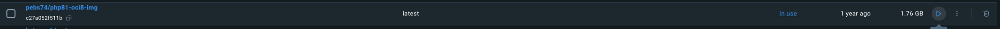
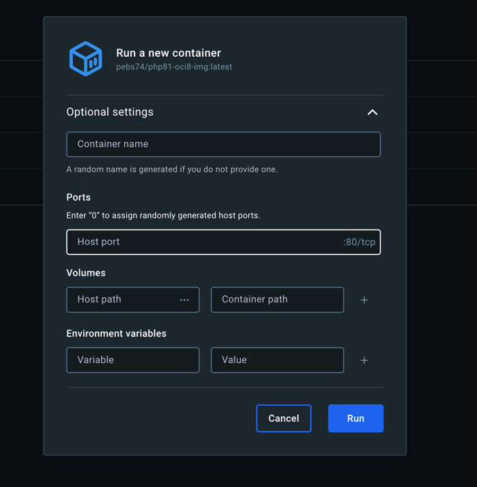
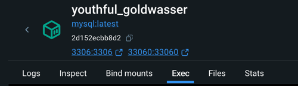
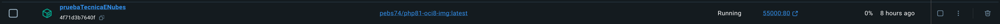
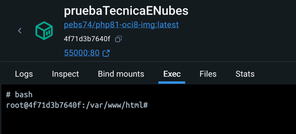
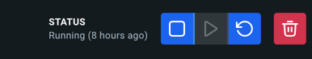

# Hotel Paula - Prueba Técnica eNubes

# Tabla de Contenidos

1. [Introducción](#introducción)
2. [Autor](#autor)
3. [Instalación](#instalación)  
   3.1 [Instalar Docker](#instalar-docker)  
   3.2 [Instalar Docker Desktop](#instalar-docker-desktop)  
   3.3 [Configuración imagen MySQL](#Configuración-imágen-MySQL)  
   3.4 [Configuración imagen PHP](#Configuración-imágen-php)
4. [Setup](#setup)  
   4.1 [Setup MySQL](#setup-mysql)  
   4.2 [Setup PHP](#setup-php)  
   4.3 [Configuración extra para la base de datos](#configuración-extra-para-la-base-de-datos)  
   4.4 [Instalación de módulos](#instalación-de-modulos)  
   4.5 [Configuraciones del proyecto](#configuraciones-del-proyecto)  
   4.6 [Ejecución de migraciones](#ejecución-de-migraciones)  
   4.7 [Ejecución de seeders](#ejecución-de-seeders)
5. [Arquitectura](#arquitectura)  
   5.1 [Arquitectura de BBDD](#arquitectura-de-bbdd)  
   5.2 [Arquitectura del Código](#arquitectura-del-código)  
   5.2.1 [Modelo](#modelo)  
   5.2.2 [Vistas](#vistas)  
   5.2.3 [Controladores](#controladores)
6. [Filtros y Autenticación](#filtros-y-autenticación)
7. [Tareas pendientes y errores conocidos](#tareas-pendientes-de-hacer-o-errores-conocidos)  
   7.1 [Registro](#registro)  
   7.2 [Resetear Contraseña](#resetear-contraseña)  
   7.3 [Login](#login)  
   7.4 [Reserva](#reserva)  
   7.5 [PDF](#pdf)


## Introducción

Este proyecto es una prueba técnica hecha para la empresa eNubes.

Las tecnologías usadas han sido:
 - Lenguaje Backend: PHP 8+
 - Framework: CodeIgniter 4 
 - Base de datos: MySQL
 - Lenguaje Frontend: HTML
 - Librería Frontend: JQuery
 - Librería de estilos: Bootstrap 5
 - Librería para fechas: JQueryUI
 -Librería de iconos:
   - Material Symbols
   - Font Awesome
   - Tabler Icons

## Autor
Paula Blázquez Wnuk

## Instalación
Para crear este proyecto se ha usado Docker Desktop, para tanto PHP como MySQL.

### Instalar docker
En los siguientes enlaces se explica como instalar docker en nuestro sistema operativo.
- Linux: https://docs.docker.com/desktop/install/linux/
- Windows: https://docs.docker.com/desktop/install/windows-install/
- Mac: https://docs.docker.com/desktop/install/mac-install/

### Instalar Docker desktop
 En este enlace se encuentra el ejecutable para instalar Docker Desktop en todos los sistemas operativos.
 https://www.docker.com/products/docker-desktop/

Una vez instalado, debemos crear una cuenta en docker hub, para ello podemos acceder desde la esquina derecha.


Una vez creada la cuenta, en el cuadro de "Search for images" podremos buscar las dos imagenes usadas:
- pebs74/php81-oci8-img
- mysql

En ambos casos, descargaremos la primera imagen que nos aparece.

Para la imagen de **mysql** abriremos una terminal y ejecutaremos

#### Configuración imágen MySQL

```
docker run 
--hostname=cb139cc37cb7 
--mac-address=02:42:ac:11:00:02 
--env=MYSQL_ROOT_PASSWORD=mi_contraseña 
--env=PATH=/usr/local/sbin:/usr/local/bin:/usr/sbin:/usr/bin:/sbin:/bin 
--env=GOSU_VERSION=1.17 
--env=MYSQL_MAJOR=8.4 
--env=MYSQL_VERSION=8.4.0-1.el9 
--env=MYSQL_SHELL_VERSION=8.4.0-1.el9 
--volume=/var/lib/mysql 
--network=bridge 
-p 3306:3306 
-p 33060:33060 
--restart=no 
--runtime=runc -d 
mysql:latest
```
Importante:
- La base de datos se creará con usuario **root**.
- En la línea `--env=MYSQL_ROOT_PASSWORD=mi_contraseña` debemos cambiar mi_contraseña por la contraseña que queramos que
tenga la base de datos.
- En caso de tener ocupados los puertos 3306 y 33060 tendremos que cambiar el primer parámetro a otro puerto que tengamos
libre.

Para la imágen de **php** deberémos tener primero el proyecto descargado en una carpeta.

Para descargar el proyecto podemos usar: ` git clone git@github.com:pauliwikiwi/pruebaTecnicaENubes.git`

Una vez descargado, desde Docker Desktop configuraremos un contenedor php para poner en marcha nuestro proyecto.

#### Configuración imágen PHP
1. Abriremos Docker Desktop e iremos al apartado Imágenes
2. Seleccionaremos nuestra imagen en este caso y le daremos a play 
3. Se nos abrirá una ventana flotante como la siguiente
4. Configuramos la imagen
- `Container name` => Nombre que queramos darle nosotros al contenedor
- `Host port` => Vamos a usar el **55000**
- `Host path` => Seleccionaremos la ruta donde descargamos el proyecto de git. Por ejemplo `Documentos/ProyectosPhp/pruebaTecnicaENubes`
- `Container path` => Pondremos la ruta por defecto **/var/www/html**

5. Por último haremos click sobre el botón de **Run**


## Setup
### Setup MySQL
Entramos en el contenedor de Mysql desde el nombre y una vez dentro del contenedor haremos click sobre `exec`.



Escribiremos `mysql -h localhost -u root -p` y nos pedirá insertar la contraseña que hayamos puesto al
configurar el contenedor de docker.

Crearemos una base de datos con el nombre que queramos `CREATE DATABASE hotel`.
En el caso del ejemplo, el nombre para la base de datos es **hotel**.

Si queremos acceder desde un gestor de bases de datos, los datos son:
```
Host: 127.0.0.1
User: root
Password: mi_contraseña
```
### Setup PHP
Cuando ya tengamos configurado el contenedor. Debemos entrar en él haciendo click en el nombre.


Y una vez allí iremos a la pestaña de `exec`. Escribiremos `bash` y le daremos a enter.



#### Configuración extra para la base de datos
Para terminar de configurar el contenedor y que se conecte correctamente el proyecto a la base de datos. Es necesario
instalar un módulo de php de la siguiente forma:
`docker-php-ext-install mysqli`. Podremos comprobar que se instaló correctamente si al hacer un `php -m` 
en el listado localizamos **mysqli**.

Por recomendación, reiniciamos el servidor de docker desde el panel.



#### Instalación de modulos
Desde la terminal de docker desktop, haremos un `composer install` para instalar las librerías del proyecto.


#### Configuraciones del proyecto
Copiaremos el archivo `env` a `.env` y en ese archivo configuraremos:
```
CI_ENVIRONMENT=development 


# esto hace nuestra conexión con el servidor de docker de MySQL
database.default.hostname=host.docker.internal
# nombre de la base de datos que vamos a usar, en este caso hotel
database.default.database=hotel
database.default.username=root
# contraseña que hayamos puesto al crear el contenedor
database.default.password=mi_contraseña
database.default.DBDriver=MySQLi
# puerto que hayamos configurado al crear el contenedor
database.default.port=3306


#--------------------------------------------------------------------
# EMAIL
#--------------------------------------------------------------------
email.fromEmail = "tu_correo@example.com"
email.fromName = "Tu Nombre o Nombre del Proyecto"
email.SMTPHost = smtp.gmail.com
email.SMTPUser = "tu_correo@example.com"
email.SMTPPass = "tu_contraseña"
email.SMTPPort = 587
email.mailType = smtp
email.SMTPTimeout = 5
email.SMTPCrypto = tls
```

Para que nuestra base de datos tenga las tablas necesarias para funcionar correctamente. Necesitaremos ejecutar las 
migraciones y seeders creados.

#### Ejecución de migraciones
Deberemos ejecutar `php spark migrate` para que se nos creen las tablas. Deberían aparecer en nuestra base de datos un
total de 6 tablas.
- categories_rooms
- migrations
- reservations
- rooms
- status_reservations
- users

#### Ejecución de seeders
Para poblar las tablas con datos de pruebas, usaremos varios comandos.
1. `php spark db:seed CategoriesRoomSeeder`
2. `php spark db:seed StatusReservationSeeder`
3. `php spark db:seed RoomsSeeder`

Con estos pasos ya tendríamos nuestra aplicación lista para funcionar.

## Arquitectura
### Arquitectura de BBDD

Para la base de datos decidí que eran necesarias 5 tablas

- **user** - tabla de usuarios
  - id - identificador único
  - name - nombre del usuario
  - last_name - apellidos del usuario
  - contact_telephone - teléfono del usuario
  - contact_identifier - DNI/NIF/NIE del usuario
  - email - email del usuario
  - email_token - token que se usa para confirmar el email al registrarse
  - confirmed_email - campo para saber si el email esta confirmado o no
  - password - contraseña, usando hash, del usuario
  - reset_token - token que se usa para resetear las contraseñas
  - reset_token_expires - fecha de expiración del token para no poder resetear la contraseña pasado ese tiempo
- **categories_rooms** - tabla de categorías que puede tener asociada una habitación
  - id - identificador único
  - name - nombre de la categoría
  - created_at
  - updated_at
- **rooms** - tabla de las habitaciones existentes
  - id - identificador único
  - name - nombre de la habitación
  - people - cantidad de personas que entran
  - meters - los metros de la habitación
  - price - precio por día
  - id_category - categoría asociada (fk categories_rooms)
  - description - descripción de la habitación
  - television - si la habitación tiene televisión
  - minibar - si la habitación tiene minibar / nevera
  - air_conditioning - si la habitación tiene aire acondicionado
  - hair_dryer - si la habitación tiene secador
  - wifi - si la habitación tiene wifi
  - created_at
  - updated_at
- **status_reservations** - tabla de estados que puede tener una reserva
  - id - identificador único
  - name - nombre del estado
  - abbreviation - abreviatura para asociar un color a ello
  - created_at
  - updated_at
- **reservations** - tabla de reservas de usuario a una habitación
  - id - identificador único
  - id_user - identificador del usuario (fk users)
  - id_room - identificador de la habitacion (fk rooms)
  - id_status - identificador del estado (fk status_reservations)
  - entry_date - checkin en el hotel 
  - departure_date - checkout en el hotel
  - confirmed - la reserva esta confirmada o no
  - reservation_token - token para el envio de correo de confirmación de reserva
  - created_at
  - updated_at

### Arquitectura del código
Se usa una arquitectura MVC (modelo vista controlador).

#### Modelo

Los modelos se encuentran en `app/Models`.
- **CategoriesRooms** - Modelo de categories_rooms
- **Reservation** - Modelo de reservations
- **Room** - Modelo de rooms
  - getHabitacionesConCategorias() - adquiere todas las habitaciones con la categoría a la que pertenecen
- **StatusReservations** - Modelo de status_reservations
- **User** - Modelo de users

### Vistas

Las vistas se encuentran en `app/Views`. Estan divididas en distintas carpetas para separar por funcionalidad.

- **auth** - vistas que tienen que ver con el usuario. Login, registro, contraseña olvidada y recuperar contraseña.
- **emails** - plantillas de emails que se mandan.
- **errors** - páginas de error, para rutas inexistentes.
- **main** - página principal
- **reservation** - plantilla que se descarga en pdf
- **rooms** - paginas para ver habitaciones, habitaciones filtradas o reserva de habitaciones
- **user** - páginas que puede ver el usurio una vez hizo login en la aplicación. Lista de reservas, edición y vista de una reserva.

### Controladores

Los controladores se encuentran en `app/Controllers`.
- **BaseController** - Controlador base que trae CodeIgniter
- **ForgotPasswordController**
  - sendEmail() - la función manda el email de contraseña olvidada al correo del usuario
  - reset_password() - manda al usuario a la página para insertar una nueva contraseña
  - save_new_password() - guarda la nueva contraseña del usuario
- **Home**
  - index() - manda a la vista de main
- **LoginController**
  - index() - manda a la vista de login
  - authenticate() - comprueba si existe el usuario y le hace login en la aplicación mandándole a la vista de dashboard.
  Crea una sesión con información del usuario
  - logout() - elimina la sesión del usuario y manda a la vista de login
- **PdfController**
  - generateReservationPDFById() - Crea un pdf de la reserva y se descarga automáticamente
- **RegisterController**
  - index() - manda a la vista de registro
  - save() - guarda el usuario. Debería mandar un correo de confirmación de email.
  - enviarCorreoConfirmacion() - envía un email de confirmación del correo.
  - confirmarEmail() - confirma el correo y cambia los datos en la bbdd.
- **ReservationController**
  - index() - manda al dashboard con las reservas del usuario loggeado
  - getReservationById() - muestra la vista de resumen de una reserva 
  - cancelReservationById() - cancela la reserva
  - reservationRoom() - reserva una habitación, manda un correo de confirmación de reserva y 
  redirige a la vista de resumen de una reserva
  - sendMailReservationConfirm() - manda un email de confirmación de reserva
  - confirmReservation() - cambia la base de datos confirmando la reserva y manda al dashboard del usuario
  - checkAvailability() - comprueba la disponibilidad de una habitación entre dos fechas
- **RoomController**
  - filter_room() - filtra las habitaciones y devuelve las que coinciden
  - getAllRooms() - recoge todas las habitaciones con las características y lo manda a view_rooms
  - bookingRoom() - resumen de la reserva con un resumen de la habitación y las fechas seleccionadas

### Filtros y autenticación

Se creó un filtro, **LoginFilter**, que está en `app/Filters`, su uso es principalmente para poder controlar
algunas rutas donde el usuario no pudiese acceder si no había hecho login anteriormente.

Para ello es necesario incluir ese filtro en `app/Config/Filters` en la parte de 'alias'

Se añade el filtro a las rutas `$routes->group('user', ['filter' => 'auth']`, en este caso todas las rutas protegidas
empiezan por **user**, por ejemplo `user/dashboard`.

## Tareas pendientes de hacer o errores conocidos
Hay algunas tareas sin hacer o algunas funcionalidades que aunque están implementadas no funcionan correctamente.

### Registro:
- Envío de correos para confirmación del email
- Posibilidad de asociar contraseña posteriormente, para usuarios que reservan como invitado

### Resetear Contraseña
- Página de confirmación de contraseñas cambiadas correctamente

### Login
- Volver a la página en la que estabas una vez haces login

### Reserva
- Mandar correo de confirmación de la reserva
- Modificación de la reserva desde el panel de reservas del usuario
- Pasarela de pago
- Validaciones en los campos de la tarjeta de credito

### PDF
- Sacar correctamente la imagen
- Meter estilos en el pdf

